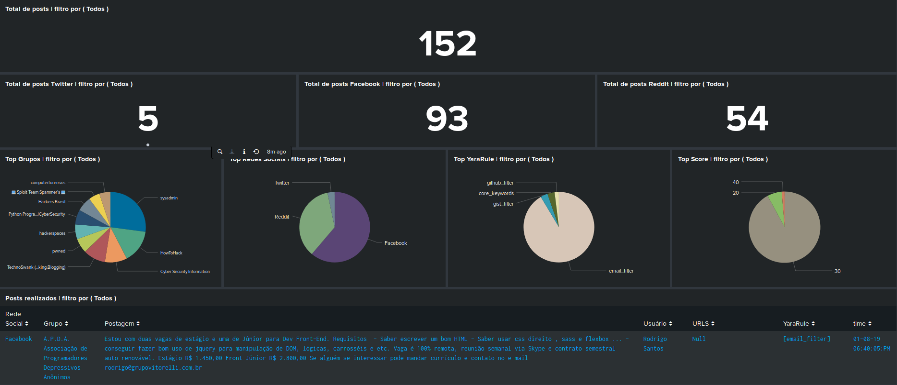

# SocialHunter to Splunk or ELK

Script to perform monitoring on social networks, with fixed groups for facebook and reddit and advanced searches on reddit.

## Info:

The script creates output in json so you can use the information in your Splunk or ELK. You can create advanced filters using YaraRule, and setting a score for each according to their criticality. This causes you to eliminate many false positives.

The main purpose of this tool is to collect possible data leaks.

## Install

```
git clone https://github.com/andreyglauzer/SocialHunter.git
cd SocialHunter
pip install -r requirements.txt
```

## Use:

```
usage: SocialHunter.py [-h] [-c CONFIG] [-l LOOP] [-f FRAMEWORK]

optional arguments:
  -h, --help            show this help message and exit
  -c CONFIG, --config CONFIG
                        The directory of the settings file, in Yaml format.
  -l LOOP, --loop LOOP  Set how many times you want to repeat the loop if you
                        want to do it endlessly. Put: 0
  -f FRAMEWORK, --framework FRAMEWORK
                        Enter the framework you want to use. In case you want
                        all inform: all Available: facebook, reddit, twitter

```

### Examples

Just doing 1 time using just facebook.

```
python SocialHunter.py --config utils/config/config.yml --loop 1 --framework facebook
```

Always run with all frameworks

```
python SocialHunter.py --config utils/config/config.yml --loop 0 --framework all
```

### Example Dashboard

<p align="center">
  
</p>
